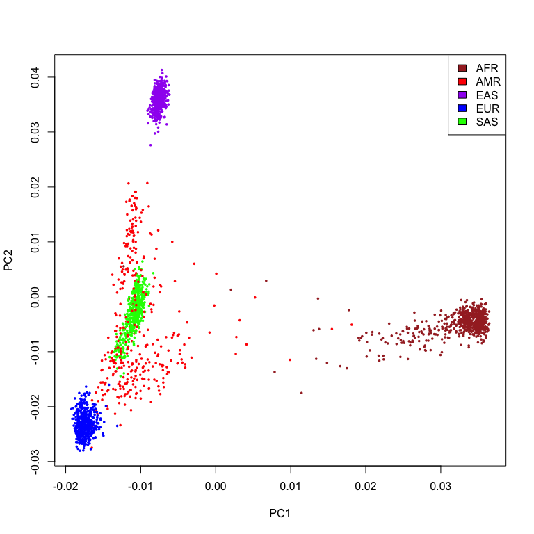

Otago Study Group: PCA, SVD and MDS (part 2)
================
Mik Black
12/12/2017

### Recap

Last time we looked at three “different” methods for dimension
reduction:

  - Principal components analysis (PCA)
  - Singular Value Decomposition (SVD)
  - Multi-Dimensional Scaling (MDS)

All of these methods are very similar in what they are trying to
accomplish (representation of high-dimensional data in a
reduced-dimensional space), and we saw that under certain conditions
(mean-centred data for SVD, and Eulidean distance for MDS) all three
methods produced the same results.

### Dimension reduction techniques in genetics: 1000 Genomes Project

Previously in Study Group we have covered the use of SVD to create
“metagenes” from gene expression data - a per-sample summary of the
expression levels of a collection of genes.

Today we’ll look at the use of SVD to explore genetic ethnicity in large
genome-wide genotyping studies, using the 1000 Genomes Project as our
example.

The data I’m using were put together by Tanya when we taught an
afternoon computer lab as part of the Summer Institute in Indigenous
Genomics Aotearoa (SING-A). We have 2504 individuals from the 1000
Genomes Project, with genotype data for 2302 ancestry-informative loci
across the genome for each individual.

``` r
load('snpData.RData')
```

``` r
dim(snpAns)
```

    ## [1] 2504 2305

``` r
head(snpAns[,1:6])
```

    ##      SubjectID Population SubPopulation rs1000022 rs10007810 rs10009024
    ## 1 Subject_0001        AFR       AFR_ACB        TT         AA         TT
    ## 2 Subject_0002        EAS       EAS_CHS        CC         GG         TT
    ## 3 Subject_0003        EUR       EUR_GBR        TT         GG         TT
    ## 4 Subject_0004        SAS       SAS_PJL        CT         AG         TT
    ## 5 Subject_0005        SAS       SAS_PJL        CC         AG         TT
    ## 6 Subject_0006        EAS       EAS_CHS        TT         GG         TT

Have a look using the View command:

``` r
View(snpAns)
```

Population data:

``` r
table(snpAns$SubPopulation, snpAns$Population)
```

    ##          
    ##           AFR AMR EAS EUR SAS
    ##   AFR_ACB  96   0   0   0   0
    ##   AFR_ASW  61   0   0   0   0
    ##   AFR_ESN  99   0   0   0   0
    ##   AFR_GWD 113   0   0   0   0
    ##   AFR_LWK  99   0   0   0   0
    ##   AFR_MSL  85   0   0   0   0
    ##   AFR_YRI 108   0   0   0   0
    ##   AMR_CLM   0  94   0   0   0
    ##   AMR_MXL   0  64   0   0   0
    ##   AMR_PEL   0  85   0   0   0
    ##   AMR_PUR   0 104   0   0   0
    ##   EAS_CDX   0   0  93   0   0
    ##   EAS_CHB   0   0 103   0   0
    ##   EAS_CHS   0   0 105   0   0
    ##   EAS_JPT   0   0 104   0   0
    ##   EAS_KHV   0   0  99   0   0
    ##   EUR_CEU   0   0   0  99   0
    ##   EUR_FIN   0   0   0  99   0
    ##   EUR_GBR   0   0   0  91   0
    ##   EUR_IBS   0   0   0 107   0
    ##   EUR_TSI   0   0   0 107   0
    ##   SAS_BEB   0   0   0   0  86
    ##   SAS_GIH   0   0   0   0 103
    ##   SAS_ITU   0   0   0   0 102
    ##   SAS_PJL   0   0   0   0  96
    ##   SAS_STU   0   0   0   0 102

To examine population diversity, we need to do two things:

1.  create a data object of ONLY the SNP genotype data (i.e., remove the
    first three columns).
2.  convert the genotypes to allele counts (e.g., TT, AT, AA to 0, 1, 2
    - count the number of A’s).

Step 1:

``` r
## Create object containing only the SNP data - remove the first three columns
snpAnsDat = snpAns[,-c(1,2,3)]
```

Step 2:

``` r
## Function for creating 0,1,2 genotype data, with major allele homozygote as 0
alleleCounts <- function(x){
  gt <- names(table(x))
  alleles <- unique(unlist(strsplit(gt,'')))
  oo <- order(sapply(alleles,function(z) sum(grep(z,x))),decreasing=T)
  alleles <- alleles[oo]
  geno<-c(paste(alleles[1],alleles[1],collapse='',sep=''),
          paste(sort(alleles),collapse='',sep=''),  
          paste(alleles[2],alleles[2],collapse='',sep=''))
  return(sapply(x,match,geno) - 1)
}
```

``` r
## Apply the function to the genotype data, one column (SNP) at a time
## This will take 30 seconds or so...
snpAnsCount = apply(snpAnsDat, 2, alleleCounts)
```

Now we have a data set of just the SNP data, with genotypes converted to
allele counts.

``` r
head(snpAnsCount[,1:6])
```

    ##   rs1000022 rs10007810 rs10009024 rs10009253 rs1000960 rs10010950
    ## 1         0          2          0          2         1          1
    ## 2         2          0          0          1         1          2
    ## 3         0          0          0          0         0          1
    ## 4         1          1          0          0         0          1
    ## 5         2          1          0          0         1          1
    ## 6         0          0          0          1         1          1

Have a look at the new data set using the View command:

``` r
View(snpAnsCount)
```

So, what are we going to do with this new data set?

### Dimension reduction

In terms of examining population diversity, we have 2302 dimensions of
data available - one dimension for each SNP.

Rather than trying to comprehend this huge amount of data in
2302-dimensional space, genetics researchers often use Principal
Components Analysis (PCA) to reduce the dimensionality of the data.

The idea is to find the most important variation in the data, and
examine the samples in terms of that variation, ignoring the rest. In
practice, this works fairly well, because genetic differences between
populations provide a strong (and relatively consistent) source of
variation across genomic loci (i.e., SNPs). Rather than looking at 2302
dimensions of data, we end up looking at variation across just 2 or 3
dimensions - each dimension is defined by a combination of SNPs which
vary in a similar way across the individuals in the study.

Here is the function I used to use to do this in my GENE360 Population
Genetic Diversity module. It calculates the first three eigenvectors
using PCA:

``` r
pcaGenotypes <- function(x){
  ## Calculate columns sample means (and divide by two)
  sm<-colMeans(x/2)
  
  ## Divide allele counts by 2 (generate "frequencies")
  ## and subtract off row-means 
  gg <- t( t(x/2) - rowMeans(t(x/2)) ) / sqrt(sm*(1-sm))
  
  ## Create covariance matrix (from last session)
  hh <- 1/ncol(x) * gg%*%t(gg)
  
  ## Perform eigenvector decomposition on covarience matrix
  return(eigen(hh)$vectors[,1:3])
}
```

Run it (but actually don’t, because it takes ages) via:

``` r
evecPCA = pcaGenotypes(snpAnsCount)
```

The following command runs the code, but also times it to see how long
it takes:

``` r
system.time(evecPCA <- pcaGenotypes(snpAnsCount))
```

    ##    user  system elapsed 
    ##  40.935   0.910  48.802

A quicker way to perform dimension reduction is via the `rsvd` package,
which uses an approximation to compute the “low-rank SVD” (i.e., just
the first few PCs) of a rectangular matrix.

*Note that you need to transpose the data matrix prior to performing
SVD):*

``` r
library(rsvd)
sm <- colMeans( snpAnsCount / 2 )  
gg <- t(t(snpAnsCount/2) - rowMeans(t(snpAnsCount/2))) / sqrt(sm*(1-sm))

system.time(evecRSVD <- rsvd( t(gg), k=3))
```

    ##    user  system elapsed 
    ##   0.683   0.033   0.760

Much faster…

Compare the first three eigenvectors generated by `rvsd` to those from
PCA:

``` r
par(mfrow=c(1,3))
for(i in 1:3) plot(evecRSVD$v[,i], evecPCA[,i])
```

<!-- -->

First couple are pretty good, but PC3 is looking a bit fuzzy.

The more eignevectors get calculated, the better the approximation for
the first few:

``` r
## 5 dimensions
evecRSVD <- rsvd( t(gg), k=5)
par(mfrow=c(1,3))
for(i in 1:3) plot(evecRSVD$v[,i], evecPCA[,i])
```

<!-- -->

``` r
## 50 dimensions
evecRSVD <- rsvd( t(gg), k=50)
par(mfrow=c(1,3))
for(i in 1:3) plot(evecRSVD$v[,i], evecPCA[,i])
```

<!-- -->

``` r
## 100 dimensions
evecRSVD <- rsvd( t(gg), k=100)
par(mfrow=c(1,3))
for(i in 1:3) plot(evecRSVD$v[,i], evecPCA[,i])
```

<!-- -->

Here’s what a scatterplot of the first two PC’s looks like.

Merriman lab - look familiar…???

``` r
plot(evecRSVD$v[,1], evecRSVD$v[,2], xlab="PC1", ylab="PC2")
```

<!-- -->

Need to add some colour:

``` r
## Create an object relating to the population data
ansPop = snpAns$Population

## Generate colours to associate with each population
pCols = c("brown","red","purple","blue","green")
names(pCols) <- c("AFR", "AMR", "EAS", "EUR", "SAS")

popCol = pCols[as.numeric(as.factor(ansPop))]
names(popCol) = ansPop

## Check that they correspond to populations
table(popCol, ansPop)
```

    ##         ansPop
    ## popCol   AFR AMR EAS EUR SAS
    ##   blue     0   0   0 503   0
    ##   brown  661   0   0   0   0
    ##   green    0   0   0   0 489
    ##   purple   0   0 504   0   0
    ##   red      0 347   0   0   0

Re-plot first two eigenvectors, and add population colours.

``` r
plot(evecRSVD$v[,1], evecRSVD$v[,2], col=popCol, xlab="PC1", ylab="PC2", pch=16, cex=0.5)
legend('topright', c("AFR", "AMR", "EAS", "EUR", "SAS"), fill=c("brown","red","purple","blue","green"))
```

<!-- -->

Plot each of the first three eignevectors against each other

``` r
par(mfrow=c(2,2))
plot(evecRSVD$v[,1], evecRSVD$v[,2], col=popCol, xlab="PC1", ylab="PC2", pch=16, cex=0.5)
legend('topright', c("AFR", "AMR", "EAS", "EUR", "SAS"), fill=c("brown","red","purple","blue","green"))

plot(evecRSVD$v[,1], evecRSVD$v[,3], col=popCol, xlab="PC1", ylab="PC3", pch=16, cex=0.5)
legend('topright', c("AFR", "AMR", "EAS", "EUR", "SAS"), fill=c("brown","red","purple","blue","green"))

plot(evecRSVD$v[,2], evecRSVD$v[,3], col=popCol, xlab="PC2", ylab="PC3", pch=16, cex=0.5)
legend('topright', c("AFR", "AMR", "EAS", "EUR", "SAS"), fill=c("brown","red","purple","blue","green"))
```

<!-- -->

From the plots we can see that samples from the same population tend to
cluster together, and that the first three principal components do a
reasonable job of capturing the genetic diversity between the
populations.

With the `scatterplot3d` package, you can plot the first three principal
components at once (i.e., combining the information from the three
scatterplots above). This shows that the European (EUR), East Asian
(EAS) and South Asian (SAS) super-populations are relatively
homogeneous, while the Ad-Mixed American (AMR) and African (AFR)
super-populations exhibit greater variation, suggesting admixture within
these groups.

``` r
library(scatterplot3d)
scatterplot3d(evecRSVD$v[,1], evecRSVD$v[,2], evecRSVD$v[,3], color=popCol, pch=16,
              cex.symbols=0.5, xlab="PC1", ylab="PC2", zlab="PC3")
```

<!-- -->

### Gloabl vs local genotype similarity

The PCA/SVD approach calculates principal components which summarize
genotype variation, at the whole-genome level. This means that the
positioning on an individual on the scatterplot relates to their
genome-wide genotype data, and their proximity to other individuals
reflects similarity at the genome-wide scale. This type of similarity
measure could be considreed a “global” assessment of genotype variation.

It is also possible to consider “local” genotype similarity, at multiple
regions of the genome. The speed of `rsvd` means that we easily can
define subsets of SNPs (e.g., a specific region of a chromosome), and
perform the analysis multiple times as we move across the genome. This
may lead to changes in how the scatterplot looks, as a result of
differing genetic ancestry (and thus differing similarity) in different
regions of the genome.

To perform any sort of “local” analysis, first need to obtain SNP
locations.

``` r
library(dplyr)
library(magrittr)
library(SNPlocs.Hsapiens.dbSNP144.GRCh37)
```

Extract location information from the `SNPlocs.Hsapiens.dbSNP144.GRCh37`
package:

``` r
snps <- SNPlocs.Hsapiens.dbSNP144.GRCh37
snpLoc <- snpsById(snps,colnames(snpAnsDat))
```

``` r
head(snpLoc)
```

    ## GPos object with 6 positions and 2 metadata columns:
    ##       seqnames       pos strand |   RefSNP_id alleles_as_ambig
    ##          <Rle> <integer>  <Rle> | <character>      <character>
    ##   [1]       13 100461219      * |   rs1000022                Y
    ##   [2]        4  41554364      * |  rs10007810                R
    ##   [3]        4  97644876      * |  rs10009024                Y
    ##   [4]        4  11216238      * |  rs10009253                Y
    ##   [5]       11  79376133      * |   rs1000960                Y
    ##   [6]        4 151574839      * |  rs10010950                Y
    ##   -------
    ##   seqinfo: 25 sequences (1 circular) from GRCh37.p13 genome

How many SNPs per chromosome?

``` r
table(seqnames(snpLoc))
```

    ## 
    ##   1   2   3   4   5   6   7   8   9  10  11  12  13  14  15  16  17  18 
    ## 188 221 172 163 152 141 119 132  98 106 117 114  85  79  66  65  68  66 
    ##  19  20  21  22   X   Y  MT 
    ##  41  51  30  28   0   0   0

Calculate chromosome region covered, number of SNPs, and average
inter-SNP distance.

``` r
chrs <- names(table(seqnames(snpLoc)))[c(1,12,16:22,2:11,13:15)]
data.frame(Chr = chrs,
           SNPs = unlist(lapply(chrs, function(x) sum(as.vector(seqnames(snpLoc))==x))),
           MinPos = unlist(lapply(chrs, 
                                  function(x) min(pos(snpLoc)[which(as.vector(seqnames(snpLoc))==x)]))),
           MaxPos = unlist(lapply(chrs, 
                                  function(x) max(pos(snpLoc)[which(as.vector(seqnames(snpLoc))==x)])))) %>% 
  mutate(Density=(MaxPos-MinPos)/SNPs)
```

    ##    Chr SNPs   MinPos    MaxPos Density
    ## 1    1  188   894573 248227201 1315599
    ## 2   12  114  1563871 132505406 1148610
    ## 3   16   65   931686  89101485 1356458
    ## 4   17   68   699988  80280865 1170307
    ## 5   18   66  1006470  77634361 1161029
    ## 6   19   41  3565357  58952327 1350902
    ## 7   20   51  2186970  62841017 1189295
    ## 8   21   30 16537728  47695220 1038583
    ## 9   22   28 17285949  51181759 1210565
    ## 10   2  221   193882 242470544 1096274
    ## 11   3  172   669478 197624444 1145087
    ## 12   4  163  1135350 190758884 1163335
    ## 13   5  152   944298 180199307 1179309
    ## 14   6  141  2145136 170919470 1196981
    ## 15   7  119  1248880 158577140 1322086
    ## 16   8  132   326522 146225280 1105294
    ## 17   9   98  1463618 137724371 1390416
    ## 18  10  106  1412238 135379710 1263844
    ## 19  11  117  1405829 134638283 1138739
    ## 20  13   85 19980323 114897534 1116673
    ## 21  14   79 20452460 104849219 1068313
    ## 22  15   66 23077857 100572954 1174168

Rewrite the pcaGenotypes function from above using the `rsvd` function:

``` r
fastPcaGenotypes <- function(x, numComp){
  sm<-colMeans(x/2)
  gg <- t(t(x/2) - rowMeans(t(x/2))) / sqrt(sm*(1-sm))
  return(rsvd(t(gg), k=numComp)$v[,1:numComp])
}
```

Perform PCA per chromosome:

``` r
pcaChr <- list()
for(i in 1:22){
    pcaChr[[i]] = fastPcaGenotypes(snpAnsCount[,as.vector(seqnames(snpLoc))==i], 5)
}
```

Pick out an interesting individual (trust me on this one):

``` r
indiv <- which(ansPop=="AMR")[36]
indiv
```

    ## [1] 309

For each chromosome, plot the first two principal components, and colour
the populations in the same way we did above. For individual 309 plot
their location in PC1/PC2 space in black, per chromosome.

``` r
par(mfrow=c(6,4))
plot(0, 0, col="white", xlim=c(0,1), ylim=c(0,1), axes=FALSE, xlab='', ylab='')
legend(0.1, 0.95, fill=pCols, names(pCols), cex=2)

for(i in 1:22){
  plot(pcaChr[[i]][,1], pcaChr[[i]][,2], pch=20, cex=0.3,
                    col=popCol, xlab="PC 1", ylab="PC 2", main=paste("Chr",i)) 
  points(pcaChr[[i]][indiv,1], pcaChr[[i]][indiv,2], pch=16, cex=2, col="black")
}
```

<!-- -->

### Summary

  - `rsvd` makes it possible to extract the first few PCs relatively
    quickly from genome-wide genotype data.
  - “Movement” of inividual 309 around PC1/PC2 space across chromosomes
    reflects admixture, and suggests the possible ancestral group for
    each chromosome (maybe).
  - With higher resolution data (i.e., greater SNP density) it would be
    possible to perform a “sliding PCA” across the genome, effectively
    determining the ancestral original of chromosomal regions for each
    individual.
